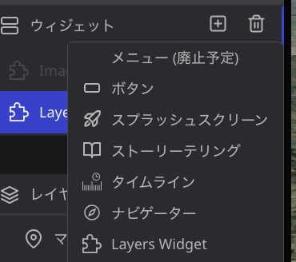

# Layers widget plugin
レイヤの表示/非表示が可能となるウィジェットを追加するプラグインです。このプラグインによって公開ページ上でもレイヤのオン/オフが可能になります。

## How to use
- Add Layers widget at widget menu, you can show layer widget.

- The contents is listed only visibility layers on Re:Earth.
- You can turn on/off layer's visibility by click check box at published page.
- You can change background color of widget at plugsin's right panel setting.

## Version up
- 1.1.0
  - Re:Earth本体のバージョンアップに伴っての更新。
- 1.0.0
  - first release

## 使い方
- プラグインをインストールするとウィジェットにLayers widgetが追加されます。

- Layers widetには、現在のプロジェクト上で表示されているレイヤが表示されます。
- ウィジェット上でチェックボックスをクリックすると、そのレイヤの表示/非表示を切り替えることができます。
- プラグインの設定でウィジェットの波形色を変更することができます
- 